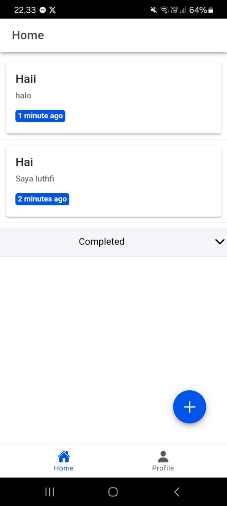
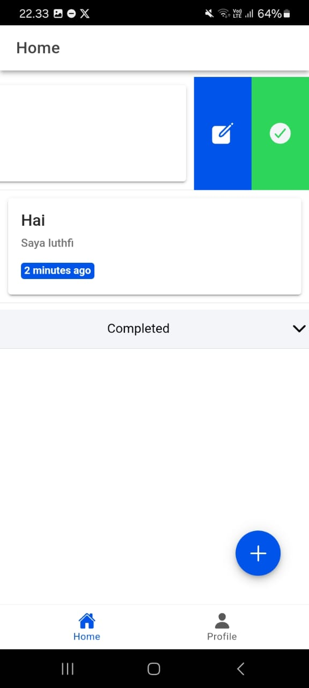
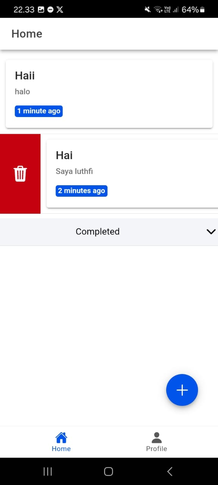
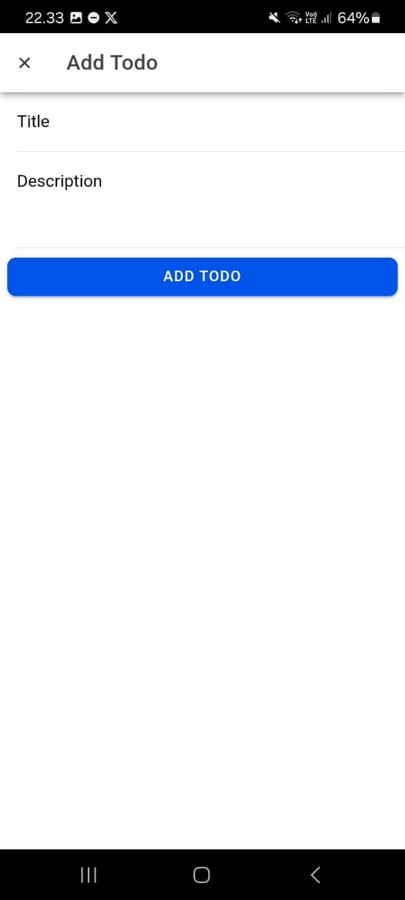
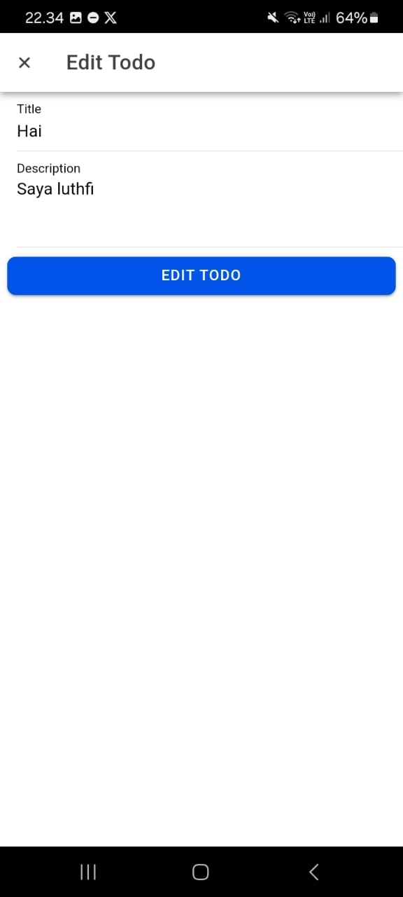
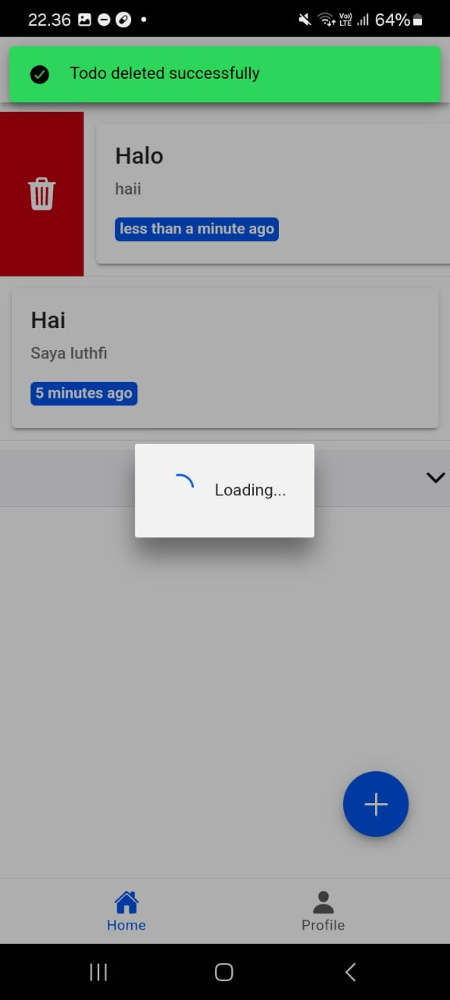
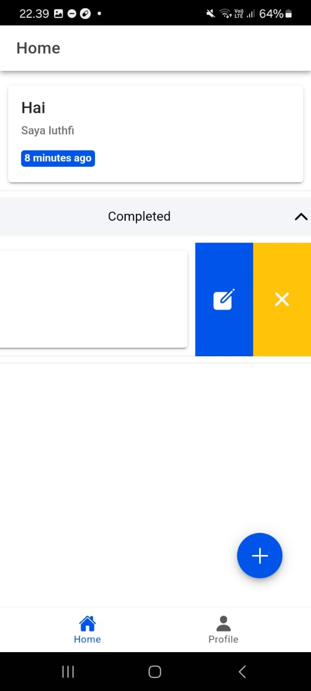
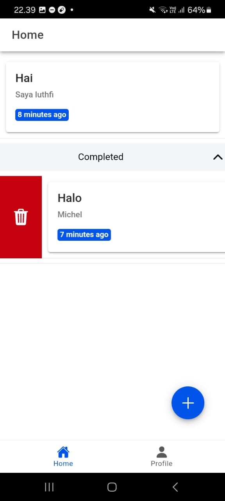

# Tugas 10 - Pertemuan 11

- **Nama** : Luthfi Arie Zulfikri
- **NIM** : H1D022061
- **Shift Lama** : A
- **Shift Baru** : A

---

# Screenshot Aplikasi

### **1. Tampilan Awal dengan Data**

  
  
  

Pada halaman awal ini menampilkan daftar tugas yang sedang aktif (belum selesai). Tugas-tugas ditampilkan dalam bentuk _card_ atau daftar, dengan informasi seperti Judul tugas, Deskripsi tugas, dan Tanggal diperbarui terakhir.

Selain itu, terdapat beberapa interaksi seperti berikut:

- **Swipe ke kanan**: Untuk menghapus tugas. Tugas yang dihapus akan langsung hilang dari daftar.
- **Swipe ke kiri**: Untuk menandai tugas sebagai selesai. Tugas yang selesai tidak lagi muncul di daftar utama, tetapi dipindahkan ke bagian tugas selesai (Completed Todos).

Jika tidak ada tugas aktif, tampilan akan menunjukkan pesan "No active todos found", memberikan indikasi bahwa belum ada tugas yang dibuat atau semua tugas telah selesai.

### **2. Tampilan Tambah Data**

  

Tampilan tambah data ini berupa formulir yang muncul dalam bentuk _modal_ untuk menambahkan tugas baru. Komponen utamanya meliputi:

- **Input Judul**: Kolom untuk mengisi nama atau topik tugas.
- **Input Deskripsi**: Kolom untuk menambahkan detail atau keterangan terkait tugas.
- **Tombol Submit**: Untuk menyimpan tugas yang baru dibuat.

Ketika pengguna mengisi formulir dan menekan tombol submit, tugas baru ditambahkan ke daftar tugas aktif. Tugas ini akan langsung muncul di halaman utama dengan data yang telah dimasukkan.

### **3. Tampilan Edit Data**

  
  

Untuk menampilkan edit data, pengguna harus swipe ke kiri dan mengklik tombol edit. Tampilan edit data juga berupa formulir dalam bentuk _modal_, seperti pada tambah data. Namun, formulir ini sudah diisi otomatis dengan data tugas yang dipilih untuk diedit. Elemen-elemen utama meliputi:

- **Input Judul**: Menampilkan judul tugas yang dapat diubah.
- **Input Deskripsi**: Menampilkan deskripsi tugas yang dapat diperbarui.
- **Tombol Submit**: Untuk menyimpan perubahan.

Setelah pengguna mengedit data dan menekan tombol submit, perubahan langsung diterapkan pada tugas yang dipilih. Tampilan halaman utama akan diperbarui untuk mencerminkan perubahan yang telah dilakukan.

### **4. Tampilan Hapus Data**

  
  

Fitur hapus data diakses langsung dari daftar tugas di tampilan utama melalui aksi **Swipe ke kanan**.. Aksi ini akan langsung menghapus tugas dari daftar.Tugas yang dihapus langsung hilang dari daftar dan akan memunculkan notifikasi berhasil menghapus data

### **5. Tampilan Complete Todo**

  
  

Tampilan ini adalah bagian untuk menampilkan daftar tugas yang telah selesai. Bagian ini disembunyikan di bawah sebuah _accordion_ atau bagian yang dapat diperluas. Ketika pengguna membuka bagian ini, daftar tugas selesai akan muncul dengan informasi seperti Judul tugas, Deskripsi tugas, dan Tanggal diperbarui terakhir.

Pengguna juga dapat melakukan beberapa aksi pada tugas selesai:

- **Memulihkan Tugas**: Memindahkan tugas kembali ke daftar aktif untuk dikerjakan ulang.
- **Edit Tugas**: Membuka formulir edit untuk memperbarui data tugas selesai.
- **Hapus Tugas**: Menghapus tugas selesai secara permanen dari daftar.

---

# Build Proyek Menjadi APK

1. Jalankan perintah `ionic capacitor add android` untuk menambahkan platform Android ke proyek Ionic.
2. Daftarkan aplikasi di Firebase Console dengan membuat proyek baru atau menggunakan proyek yang sudah ada. Kemudian konfigurasikan pada android dan unduh file konfigurasi `google-services.json`. Salin file tersebut ke folder `android/app` pada proyek.
3. Buka file `android/app/build.gradle` dan tambahkan baris `apply plugin: 'com.google.gms.google-services'` untuk mengaktifkan plugin Firebase.
4. Buat build web untuk digunakan oleh Capacitor dengan menjalankan perintah `ionic build`.
5. Sinkronkan perubahan ke proyek Android dengan perintah `npx cap sync`.
6. Buka proyek Android di Android Studio menggunakan perintah `npx cap open android`.
7. Generate **SHA-1 Certificate Fingerprint** dan masukkan hasilnya ke pengaturan aplikasi Android di Firebase Console.
8. Buat file APK melalui menu **Build > Build Bundle(s)/APK(s) > Build APK(s)** di Android Studio.
9. Proses akan menghasilkan file `app-debug.apk` untuk pengujian aplikasi.

## File Aplikasi

Berikut merupakan file app-debug.apk yang telah dibuat:

